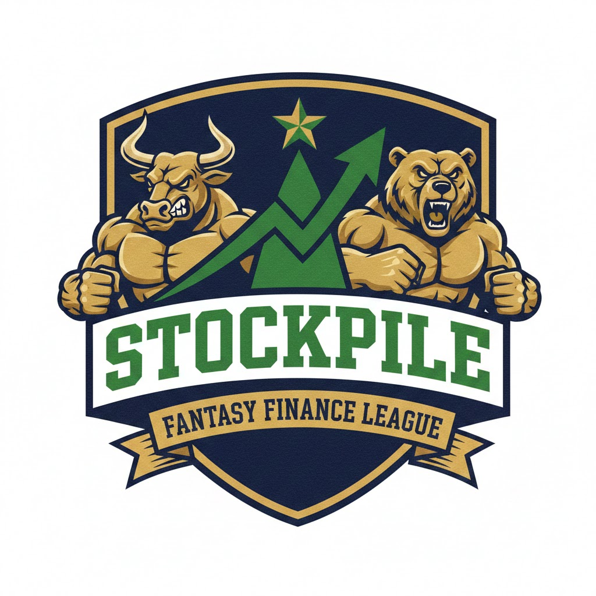
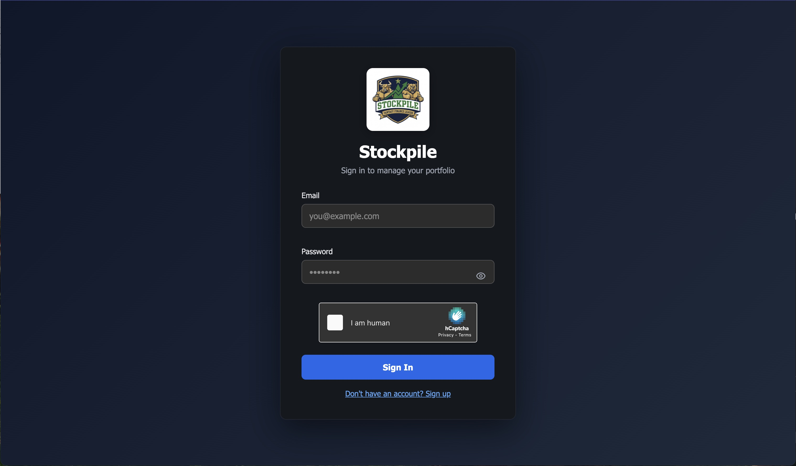
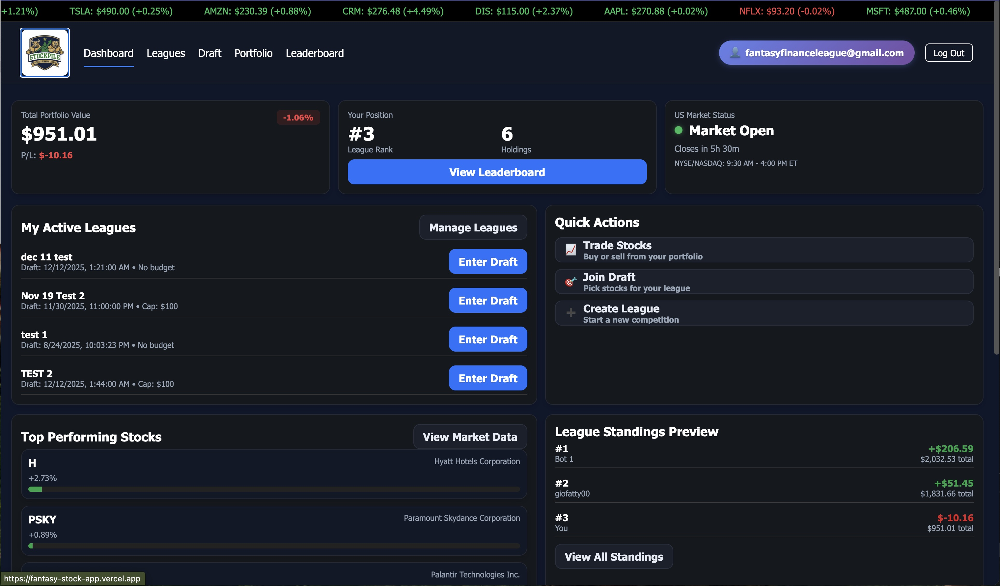

# Stockpile

A fantasy finance platform where friends compete to build the best portfolio. Think fantasy football, but for investing.

**Status:** Early development / Active testing

**[Live Demo](https://fantasy-stock-app.vercel.app/)**

<p align="center">
  
</p>

<p align="center">
  
  
</p>

---

## What is this?

Stockpile makes personal investing less intimidating by turning it into a game. Users can:

- **Practice with paper trading** - Learn portfolio management with simulated money through Alpaca's paper trading
- **Compete with friends** - Create leagues and see who can build the best-performing portfolio
- **Trade real stocks** (coming soon) - For more seasoned investors, connect a live Alpaca account to compete with real investments

The goal is to make personal finance approachable and fun, bringing the social competition of fantasy sports to investing.

## Current Features

- User authentication (sign up / sign in)
- Link Alpaca paper trading account
- Real-time stock quotes via Alpaca API
- Portfolio tracking with live prices
- Stock search and discovery

## Tech Stack

- **Frontend:** React, Vite, Tailwind CSS
- **Backend:** Supabase (Auth, Database, Edge Functions)
- **Market Data & Trading:** Alpaca API
- **Hosting:** Vercel

## Local Development

```bash
# Install dependencies
npm install

# Set up environment variables
cp .env.example .env.local
# Add your Supabase and Alpaca credentials to .env.local

# Start development server
npm run dev
```

## Project Structure

```
src/
  ├── pages/        # Main application pages
  ├── components/   # Reusable UI components
  ├── auth/         # Authentication logic
  └── supabase/     # Supabase client setup

supabase/
  └── functions/    # Edge functions for secure API calls
```

## What's Next

- **Refining the draft process** - Improving the stock draft experience for league competitions
- **Live stock trading** - Alpaca integration for real money trading (for experienced investors)
- **Portfolio performance charts** - Visual graphs showing portfolio value over time
- **Trade history & activity feed** - Log of trades and league activity

## Roadmap

- [ ] League creation and management
- [ ] Leaderboards and rankings
- [ ] Live trading integration
- [ ] Performance analytics
- [ ] Mobile optimization

## About

Built from scratch as both a learning project and a real product idea. This project explores full-stack development with React, serverless functions, and third-party API integrations.

---

*Built with the assistance of Claude Code*
