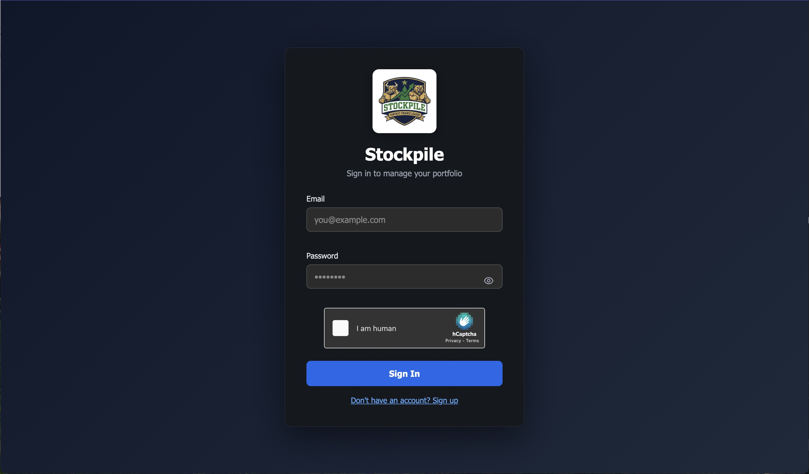
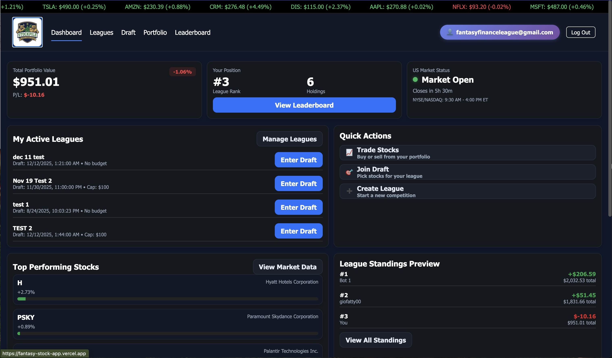

# Stockpile

A fantasy finance platform where friends compete to build the best portfolio. Think fantasy football, but for investing.

**Status:** Early development / Active testing

**[Live Demo](https://fantasy-stock-app.vercel.app/)**

<p align="center">
  
</p>

<p align="center">
  
  
</p>

---

## What is this?

Stockpile makes personal investing less intimidating by turning it into a game. Users can:

- **Practice with paper trading** - Learn portfolio management with simulated money through Alpaca's paper trading
- **Compete with friends** - Create leagues and see who can build the best-performing portfolio
- **Trade real stocks** (coming soon) - For more seasoned investors, connect a live Alpaca account to compete with real investments

The goal is to make personal finance approachable and fun, bringing the social competition of fantasy sports to investing.

## Project Structure

This is a monorepo containing both the web and mobile applications:

```
fantasy-stock/
├── apps/
│   ├── web/              # React web application
│   └── mobile/           # React Native (Expo) mobile app
├── packages/
│   └── shared/           # Shared code between web and mobile
│       ├── constants/    # Shared constants
│       ├── types/        # TypeScript types
│       └── utils/        # Shared utilities (content moderation, etc.)
├── supabase/             # Supabase edge functions and migrations
└── package.json          # Root workspace configuration
```

## Current Features

- User authentication (sign up / sign in)
- Link Alpaca paper trading account
- Real-time stock quotes via Alpaca API
- Portfolio tracking with live prices
- Stock search and discovery
- League creation and management
- Snake draft system
- Weekly matchups and standings
- **Automated weekly scoring** - Monday-Friday matchup weeks with automatic result processing
- **Smart scoring system** - Dollar gain with mid-week trade tracking
- **Playoff bracket generation** - Automatic seeding and bracket creation
- **Real-time updates** - Supabase subscriptions for live standings/matchup updates
- **Mobile app features**:
  - ESPN-style league switcher dropdown on all pages
  - Swipeable league carousel on Home page
  - Week navigation for viewing past matchups
  - Sticky headers that follow scroll

## Tech Stack

- **Web Frontend:** React, Vite, Tailwind CSS
- **Mobile App:** React Native, Expo, Expo Router
- **Backend:** Supabase (Auth, Database, Edge Functions)
- **Market Data & Trading:** Alpaca API
- **Web Hosting:** Vercel

## Local Development

### Prerequisites
- Node.js 18+
- npm 9+

### Web Application

```bash
# From root directory
npm install
npm run web

# Or from apps/web
cd apps/web
npm install
npm run dev
```

### Mobile Application

```bash
# From root directory
npm run mobile

# Or from apps/mobile
cd apps/mobile
npm install
npx expo start
```

### Environment Variables

**Web (`apps/web/.env.local`):**
```
VITE_SUPABASE_URL=your_supabase_url
VITE_SUPABASE_ANON_KEY=your_supabase_anon_key
```

**Mobile (`apps/mobile/.env`):**
```
EXPO_PUBLIC_SUPABASE_URL=your_supabase_url
EXPO_PUBLIC_SUPABASE_ANON_KEY=your_supabase_anon_key
```

## Roadmap

- [x] League creation and management
- [x] Snake draft system
- [x] Leaderboards and rankings
- [x] Mobile app (iOS/Android)
- [x] Automated weekly matchup processing
- [x] Holiday-aware scheduling (Alpaca calendar API)
- [x] Real-time standings updates (auto-refresh on week end)
- [x] Mobile app navigation redesign (ESPN-style league switcher)
- [ ] Live trading integration
- [ ] Email notifications
- [ ] Push notifications

## About

Built from scratch as both a learning project and a real product idea. This project explores full-stack development with React, React Native, serverless functions, and third-party API integrations.

---

*Built with the assistance of Claude Code*
