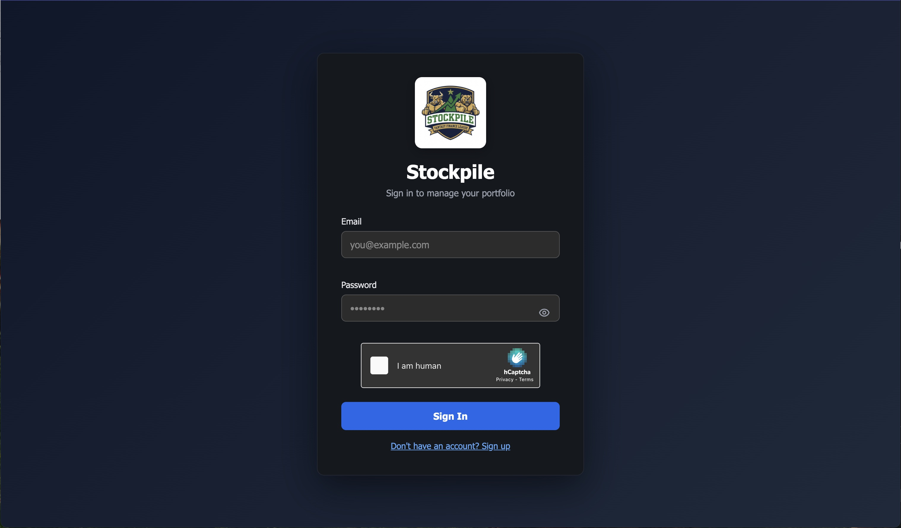
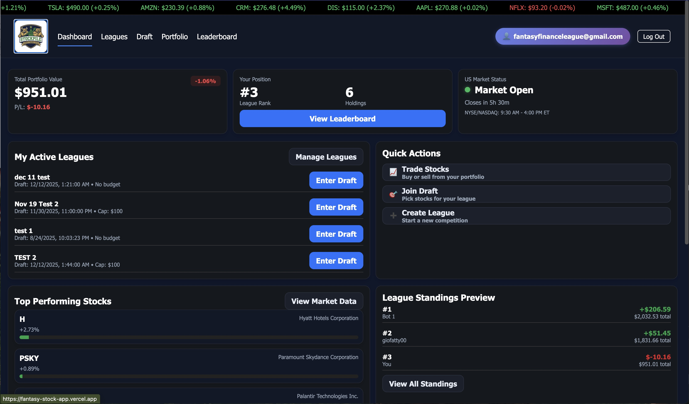

# Stockpile

A fantasy finance platform where friends compete to build the best portfolio. Think fantasy football, but for investing.

**Status:** Pre-launch / closed testing. Mobile (Expo) is the primary product surface; the web app is deployed but paused to a "coming soon" landing page, and new signups are closed server-side. Current state, open defects and the path to beta: **[`docs/STATUS.md`](docs/STATUS.md)**.

**[Landing page](https://fantasy-stock-app.vercel.app/)**

<p align="center">
  
</p>

<p align="center">
  
  
</p>

---

## What is this?

Stockpile makes personal investing less intimidating by turning it into a game:

- **Draft real stocks** — leagues snake-draft from the real US equity universe, with simulated money. No brokerage account, no linking, no KYC.
- **Compete with friends** — weekly head-to-head matchups (Monday open → Friday close, scored on dollar gain), standings, playoffs and multi-season history; or a single long "duration" race.
- **Commissioner-configurable rules** — stake modes (fixed notional per slot, price tiers, or budget cap), draft slots with price brackets and category filters, and a draftable-universe filter.
- **Real-money leagues** (future, demand-gated) — only via a proper broker integration (OAuth/aggregator), never key copy-paste. See [DR-001](docs/decisions/DR-001-in-house-simulated-trading.md).

## Project structure

```
fantasy-stock/
├── apps/
│   ├── mobile/          # React Native (Expo Router) app — primary product
│   └── web/             # React + Vite web app (Vercel) — currently paused to landing page
├── packages/
│   └── shared/          # Code shared by both apps (password policy, content moderation, types)
├── supabase/
│   ├── functions/       # Edge functions (Deno) + _shared pure modules with hermetic tests
│   ├── migrations/      # SQL migrations (applied with `supabase db push`)
│   ├── seed/            # Curated category data → generated seed migration
│   └── config.toml      # Per-function verify_jwt (the repo is the source of truth)
├── scripts/             # Architecture-map generator, seed generator, season simulation harness
├── docs/                # Status, decisions, architecture map, specs — start at docs/README.md
└── CLAUDE.md            # Repo conventions and operational rules (read before changing backend code)
```

## Features

**Gameplay**
- Leagues: create, join by invite code (server-side preview + atomic join), commissioner settings, multi-season with championship history
- Snake draft with real-time updates; every pick validated server-side (`validate-and-record-pick`): turn order, uniqueness, draftable universe, slot category/price brackets, stake-mode budget
- Post-draft buys and sells validated server-side (`record-trade`)
- Stake modes: fixed notional (fractional shares), price tiers, budget cap
- ~10 curated stock categories over vendor industry data, with slot filters and category badges in the draft UI
- Weekly matchups scored automatically on dollar gain, including mid-week trades; playoffs and season completion
- Holiday-aware scheduling (Alpaca market calendar)

**Platform**
- Server-side market data on Stockpile's own Alpaca key (quotes, historical bars) + Finnhub (company profiles)
- Automated pipeline: Monday snapshot → Friday snapshot → scoring, with retry and all-or-nothing writes per league
- Row-level security on every league table; cron functions authenticated with a dedicated secret key
- Server-side signup gate (Supabase "Before User Created" hook) with an allowlist
- Mobile: push notifications (draft turns), password reset via deep link, EAS Build + EAS Update (OTA)

## Tech stack

- **Mobile:** React Native 0.81, Expo SDK 54, Expo Router, TypeScript
- **Web:** React 19, Vite 7, Tailwind CSS 4 — hosted on Vercel (merging to `main` deploys to production)
- **Backend:** Supabase — Postgres + RLS, Auth, Realtime, Edge Functions (Deno), pg_cron + pg_net, Vault
- **Market data:** Alpaca (prices, calendar) and Finnhub (company profiles), server-side only

## Local development

### Prerequisites
- Node.js 18+, npm 9+
- [Deno](https://deno.com/) — runs the edge-function unit tests
- [gitleaks](https://github.com/gitleaks/gitleaks) — required by the pre-commit hook (it fails closed without it)

One-time setup per clone:

```bash
npm install
brew install gitleaks
git config core.hooksPath .githooks
```

### Web

```bash
cd apps/web
npm run dev
```

The UI is gated by `APP_PAUSED` in `apps/web/src/App.jsx`. While it is `true`, `npm run build` tree-shakes every page, so a green build proves nothing about page code — see `CLAUDE.md`.

### Mobile

```bash
cd apps/mobile
npx expo start
```

Run all Expo/EAS commands from `apps/mobile/`, never the repo root.

### Tests

```bash
deno test supabase/functions/              # hermetic edge-function unit tests
node scripts/gen-architecture.mjs --check  # architecture map is up to date
cd apps/mobile && npm run lint             # mobile ESLint
cd apps/web && npm run lint                # web ESLint
```

### Environment variables

**Web (`apps/web/.env.local`):**
```
VITE_SUPABASE_URL=your_supabase_url
VITE_SUPABASE_PUBLISHABLE_KEY=your_sb_publishable_key
VITE_HCAPTCHA_SITE_KEY=your_hcaptcha_site_key
```

**Mobile (`apps/mobile/.env`):**
```
EXPO_PUBLIC_SUPABASE_URL=your_supabase_url
EXPO_PUBLIC_SUPABASE_PUBLISHABLE_KEY=your_sb_publishable_key
```

Edge-function secrets (`SB_SECRET_KEY_*`, `ALPACA_API_KEY`/`ALPACA_API_SECRET`, `FINNHUB_API_KEY`) are set with `supabase secrets set` and never committed.

## Roadmap

- [x] Leagues, snake draft, standings, weekly matchups, playoffs, multi-season history
- [x] Automated weekly scoring with mid-week trade handling
- [x] Mobile app with push notifications, OTA updates, password reset
- [x] Security hardening: RLS on all league tables, new Supabase API keys, cron auth, function-grant lockdown
- [x] In-house simulated trading (DR-001): server-side draft/trade validation, stake modes, draft slots, categories
- [x] Server-side signup gate
- [ ] Server-side season schedule generation (blocks mobile-only leagues — see `docs/STATUS.md`)
- [ ] Remaining security findings (push-token relocation, schedule forgery)
- [ ] Mobile design-system pass + production release
- [ ] Un-pause web, open signups
- [ ] Matchup-result and invite notifications
- [ ] Real-money leagues (post-launch, demand-gated)

## Documentation

| Document | Description |
|----------|-------------|
| [`docs/STATUS.md`](docs/STATUS.md) | What's deployed, what's open, the critical path — start here |
| [`docs/README.md`](docs/README.md) | Index of all documentation |
| [`CLAUDE.md`](CLAUDE.md) | Repo conventions, deploy rules, and lessons learned (for developers and AI assistants) |
| [`apps/mobile/ARCHITECTURE.md`](apps/mobile/ARCHITECTURE.md) | Mobile app architecture — navigation, state, screens, data flow |
| [`docs/architecture/`](docs/architecture/) | Generated system map (open `architecture.html`) with a migration-vs-prod drift panel |
| [`docs/decisions/`](docs/decisions/) | Decision records |

## About

Built from scratch as both a learning project and a real product idea, exploring full-stack development with React, React Native, serverless functions, and third-party API integrations.

---

*Built with the assistance of Claude Code*
